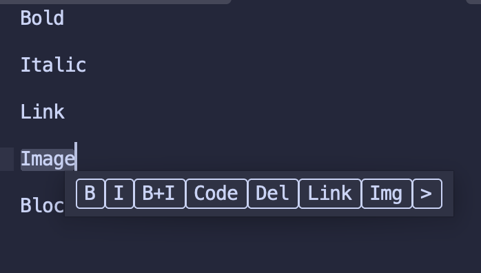

# MDToolbar

MDToolbar is a small Sublime Text package that adds a popup Markdown formatting toolbar and matching keybindings for common inline Markdown constructs.

## Features

- Popup toolbar shown near the selection with buttons for:
  - Bold: `**text**`
  - Italic: `_text_`
  - Bold + Italic: `**_text_**`
  - Inline code: `` `text` ``
  - Strikethrough: `~~text~~`
  - Link: `[text](url)`
  - Image: ``
  - Blockquote: prefixes selected lines with `> `

- Commands for each action so you can bind your own keys without using the toolbar.
## Installation

### Package Control (recommended)

1. Ensure Package Control is installed in Sublime Text.  
2. Open the Command Palette (`Ctrl+Shift+P` on Windows/Linux, `Cmd+Shift+P` on macOS) and run **“Package Control: Add Repository”**.  
3. Paste this URL and confirm:

   `https://github.com/hstagner/MDToolbar`

4. Open the Command Palette again and run **“Package Control: Install Package”**.  
5. Type **`MDToolbar`**, select it from the list, and install.  
6. Restart Sublime Text if needed, then customize key bindings in `Preferences → Key Bindings` if desired.

### Manual installation

1. Clone or download this repository into your Sublime `Packages` directory as a folder named `MDToolbar`.  
2. Restart Sublime Text; the package and its default key bindings will load automatically.

## Usage

1. Select some text in a Markdown buffer.
2. Invoke the toolbar (default keys below).
3. Click a button to wrap the selection with the chosen Markdown syntax.

Alternatively, use the direct commands without showing the toolbar.

## Default Key Bindings

### macOS

- Show toolbar: `ctrl+⌘+M`
- Bold: `ctrl+⌘+B`
- Italic: `ctrl+⌘+I`
- Bold+Italic: `ctrl+⌘+D`
- Code: `ctrl+⌘+C`
- Strikethrough: `ctrl+⌘+X`
- Link: `ctrl+⌘+L`
- Image: `ctrl+⌘+P`
- Blockquote: `ctrl+⌘+Q`

### Windows / Linux

- Show toolbar: `ctrl+alt+M`
- Bold: `ctrl+alt+B`
- Italic: `ctrl+alt+I`
- Bold+Italic: `ctrl+alt+D`
- Code: `ctrl+alt+C`
- Strikethrough: `ctrl+alt+X`
- Link: `ctrl+alt+L`
- Image: `ctrl+alt+P`
- Blockquote: `ctrl+alt+Q`

If any of these conflict in your setup, override them in your user keymap (`Preferences → Key Bindings`).

## Commands

All commands are available from the Command Palette:

- `MDToolbar: Show Markdown Toolbar`
- `MDToolbar: Bold Selection`
- `MDToolbar: Italic Selection`
- `MDToolbar: Bold+Italic Selection`
- `MDToolbar: Code Selection`
- `MDToolbar: Strikethrough Selection`
- `MDToolbar: Link Selection`
- `MDToolbar: Image Selection`
- `MDToolbar: Blockquote Selection`

## Configuration

The `MDToolbar.sublime-settings` file supports an `enabled_actions` list if you want to control which buttons appear in the popup. You can also override or add key bindings in your user keymap.